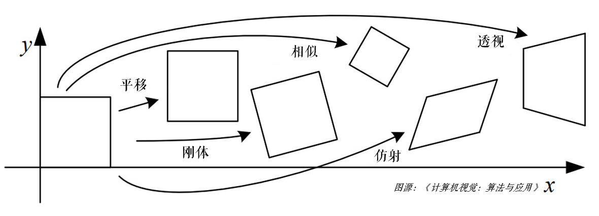

## 仿射变换

仿射变换是指在几何中，一个向量空间进行一次线性变换并接上一个平移，变换为另一个向量空间。

基本的图像变换就是二维坐标的变换：从一个二维坐标 \\((x, y)\\) 到另一个二维坐标 \\((u, v)\\) 的线性变换：

$$
\begin{split}
u = a_{1}x+b_{1}y+c_{1} \newline
v = a_{2}x+b_{2}y+c_{2}
\end{split}
$$

写成矩阵的形式：

$$\begin{bmatrix} u \newline v \end{bmatrix} = \begin{bmatrix} a_{1} & b_{1} \newline a_{2} & b_{2} \end{bmatrix} \begin{bmatrix} x \newline y \end{bmatrix} + \begin{bmatrix} c_{1} \newline c_{2} \end{bmatrix}$$

$$R=\begin{bmatrix} a_{1} & b_{1} \newline a_{2} & b_{2} \end{bmatrix},t=\begin{bmatrix} c_{1} \newline c_{2} \end{bmatrix},T=\begin{bmatrix} R & t \end{bmatrix}$$

矩阵 \\(T\\) 就是仿射变换的变换矩阵，\\(R\\) 为线性变换矩阵，\\(t\\) 为平移矩阵，简单来说，仿射变换就是线性变换+平移。变换后直线依然是直线，平行线依然是平行线，直线间的相对位置关系不变，因此非共线的三个对应点便可确定唯一的一个仿射变换，线性变换 4 个自由度 + 平移 2 个自由度 →仿射变换自由度为 6。

其实平移、旋转、缩放和翻转等变换就是对应了不同的仿射变换矩阵。

## 平移

平移就是 x 和 y 方向上的直接移动，可以上下/左右移动，自由度为 2，变换矩阵可以表示为：

$$\begin{bmatrix} u \newline v \end{bmatrix} = \begin{bmatrix} 1 & 0 \newline 0 & 1 \end{bmatrix}\begin{bmatrix} x \newline y \end{bmatrix} + \begin{bmatrix} t_{x} \newline t_{y} \end{bmatrix}$$

## 旋转

旋转是坐标轴方向饶原点旋转一定的角度 \\(\theta\\)，自由度为 1，不包含平移，如顺时针旋转可以表示为：

$$\begin{bmatrix} u \newline v \end{bmatrix} = \begin{bmatrix} \cos \theta  & -\sin \theta \newline \sin \theta & \cos \theta \end{bmatrix}\begin{bmatrix} x \newline y \end{bmatrix} + \begin{bmatrix} 0 \newline 0 \end{bmatrix}$$

## 翻转

翻转是 x 或 y 某个方向或全部方向上取反，自由度为 2，比如这里以垂直翻转为例：

$$\begin{bmatrix} u \newline v \end{bmatrix} = \begin{bmatrix} 1 & 0 \newline 0 & -1 \end{bmatrix}\begin{bmatrix} x \newline y \end{bmatrix} + \begin{bmatrix} 0 \newline 0 \end{bmatrix}$$

## 刚体变换

旋转 + 平移也称刚体变换，就是说如果图像变换前后两点间的距离仍然保持不变，那么这种变化就称为刚体变换。刚体变换包括了平移、旋转和翻转，自由度为 3。变换矩阵可以表示为：

$$\begin{bmatrix} u \newline v \end{bmatrix} = \begin{bmatrix} \cos \theta  & -\sin \theta \newline \sin \theta & \cos \theta \end{bmatrix}\begin{bmatrix} x \newline y \end{bmatrix} + \begin{bmatrix} t_{x} \newline t_{y} \end{bmatrix}$$

由于只是旋转和平移，刚体变换保持了直线间的长度不变，所以也称欧式变换（变化前后保持欧氏距离）。

## 缩放

缩放是 x 和 y 方向的尺度（倍数）变换，在有些资料上非等比例的缩放也称为拉伸/挤压，等比例缩放自由度为 1，非等比例缩放自由度为 2，矩阵可以表示为：

$$\begin{bmatrix} u \newline v \end{bmatrix} = \begin{bmatrix} s_{x} & 0 \newline 0 & s_{y} \end{bmatrix}\begin{bmatrix} x \newline y \end{bmatrix} + \begin{bmatrix} 0 \newline 0 \end{bmatrix}$$

## 相似变换

相似变换又称缩放旋转，相似变换包含了旋转、等比例缩放和平移等变换，自由度为 4。在 OpenCV 中，旋转就是用相似变换实现的：若缩放比例为 \\(scale\\)，旋转角度为 \\(\theta\\)，旋转中心是\\((center_{x}, center_{y})\\)，则仿射变换可以表示为：

$$\begin{bmatrix} u \newline v \end{bmatrix} = \begin{bmatrix} \alpha & \beta \newline -\beta & \alpha \end{bmatrix}\begin{bmatrix} x \newline y \end{bmatrix} + \begin{bmatrix} (1 - \alpha ) center_{x} - \beta center_{y} \newline \beta center_{x} + (1 - \alpha ) center_{y} \end{bmatrix}$$

$$\alpha = scale \cdot \cos \theta , \beta = scale \cdot \sin \theta$$

## 透视变换

透视变换是将二维的图片投影到一个三维视平面上，然后再转换到二维坐标下，所以也称为投影映射。简单来说就是二维 → 三维 → 二维的一个过程。

$$
\begin{split}
X = a_{1}x+b_{1}y+c_{1} \newline
Y = a_{2}x+b_{2}y+c_{2} \newline
Z = a_{3}x+b_{3}y+c_{3}
\end{split}
$$

写成矩阵的形式：

$$\begin{bmatrix} X \newline Y \newline Z \end{bmatrix} = \begin{bmatrix} a_{1} & b_{1} & c_{1} \newline a_{2} & b_{2} & c_{2} \newline a_{3} & b_{3} & c_{3} \end{bmatrix} \begin{bmatrix} x \newline y \newline 1 \end{bmatrix}$$

其中，\\(\begin{bmatrix} a_{1} & b_{1} \newline a_{2} & b_{2} \end{bmatrix}\\) 为线性变换，\\(\begin{bmatrix} a_{3} & b_{3} \end{bmatrix}\\) 为透视变换，\\(\begin{bmatrix} c_{1} \newline c_{2} \newline c_{3} \end{bmatrix}\\) 为平移变换，因此仿射变换是透视变换的子集。

接下来再通过除以 \\(Z\\) 轴转换成二维坐标：

$$
\begin{split}
x^{'}=\frac{X}{Z}=  \frac{a_{1}x+b_{1}y+c_{1}}{a_{3}x+b_{3}y+c_{3}} \newline
y^{'}=\frac{Y}{Z}=  \frac{a_{2}x+b_{2}y+c_{2}}{a_{3}x+b_{3}y+c_{3}} 
\end{split}
$$

透视变换相比仿射变换更加灵活，变换后会产生一个新的四边形，但不一定是平行四边形，所以需要非共线的四个点才能唯一确定，原图中的直线变换后依然是直线。因为四边形包括了所有的平行四边形，所以透视变换包括了所有的仿射变换。
